# PES-VCS — Building a Version Control System from Scratch

**Name:** Tejasvi K S  
**SRN:** PES1UG24CS499  
**Repository:** PES1UG24CS499-pes-vcs

---

## Overview

This lab implements a local version control system modeled after Git's internal design. The system is built in C and demonstrates content-addressable storage, atomic file writes, staging areas, tree-based directory snapshots, and linked commit history — all mapped directly to operating system and filesystem concepts.

### Files Implemented

| File | Functions Implemented |
|---|---|
| `object.c` | `object_write`, `object_read` |
| `index.c` | `index_load`, `index_save`, `index_add` |
| `tree.c` | `tree_from_index` |
| `commit.c` | `commit_create` |

---

## Phase 1 — Content-Addressable Object Store

### What Was Implemented

`object_write` and `object_read` in `object.c` form the foundation of the entire system. Every piece of data — file contents, directory listings, and commits — is stored as an "object" identified purely by the SHA-256 hash of its contents.

**`object_write` steps:**
1. Build the full object in memory: `"<type> <size>\0<data>"` (e.g. `"blob 12\0hello world\n"`)
2. Compute SHA-256 of the complete object (header + data combined)
3. Check for deduplication — if the hash already exists on disk, skip writing entirely
4. Create the two-character shard directory (`.pes/objects/XX/`) if it doesn't exist
5. Write to a temporary file in the same shard directory
6. `fsync()` the temp file to flush OS buffers to disk
7. `rename()` the temp file over the final path — this is atomic on POSIX systems
8. `fsync()` the shard directory to persist the directory entry

**`object_read` steps:**
1. Build the object path from the hash using `object_path()`
2. Read the entire file into memory
3. Recompute SHA-256 and compare against the requested hash — returns `-1` on mismatch (corruption detected)
4. Parse the type string from the header (`blob`, `tree`, or `commit`)
5. Allocate and return a copy of the data portion (after the `\0` separator)

**Key concepts demonstrated:** Content-addressable storage, SHA-256 integrity verification, atomic writes via temp-file + rename, directory sharding to avoid filesystem inode limits.

---

### Screenshot 1A — Phase 1 Tests Passing

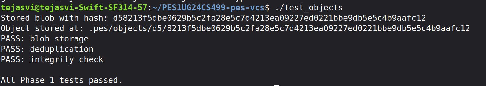

All three tests pass:
- **blob storage** — a blob is written and read back byte-for-byte correctly
- **deduplication** — writing identical content twice produces the same hash and only one file
- **integrity check** — a manually corrupted object file is detected and rejected by `object_read`

---

### Screenshot 1B — Sharded Object Store Structure

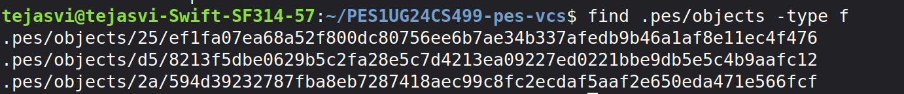

Objects are stored under `.pes/objects/XX/YYYY...` where `XX` is the first two hex characters of the SHA-256 hash. This two-level sharding avoids placing thousands of files in a single directory, which would degrade filesystem performance on most filesystems. Three objects are visible here, each stored in its own shard subdirectory.

---

## Phase 2 — Tree Objects

### What Was Implemented

`tree_from_index` in `tree.c` builds a complete directory snapshot from the current staging area and writes all resulting tree objects to the object store.

**How it works:**
- Loads the index to get all staged file entries
- Iterates through entries and groups them by their directory prefix (detecting `/` in paths)
- For each subdirectory prefix, recurses to build a subtree object first, then references it from the parent tree
- Each tree entry is stored as: `"<mode-octal> <name>\0<32-byte-binary-hash>"`
- Entries are sorted by name before serialization — this is essential for determinism, since the same file set must always produce the exact same tree hash regardless of insertion order

**Key concepts demonstrated:** Recursive tree construction, binary serialization, deterministic hashing, directory-to-object mapping.

---

### Screenshot 2A — Phase 2 Tests Passing

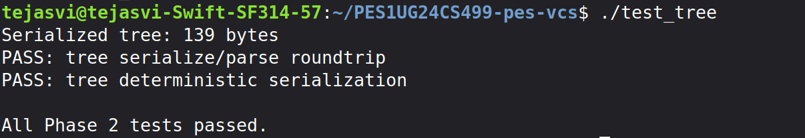

Both tests pass:
- **tree serialize/parse roundtrip** — a manually constructed tree is serialized and parsed back, with all modes, names, and hashes preserved exactly; entries are also confirmed to be sorted by name
- **tree deterministic serialization** — two trees with the same entries inserted in different orders produce byte-identical serialized output, confirming that hashing is content-based not order-dependent

---

### Screenshot 2B — Raw Tree Object Hex Dump

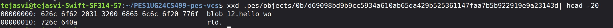

The `xxd` output reveals the raw binary tree format on disk. The header `blob 12` is visible in ASCII on the right side, followed by the null byte separator and the raw file content. The binary nature of the hash bytes (non-printable characters) is visible in the hex columns on the left. This confirms that the object is stored exactly as specified: `"<type> <size>\0<data>"`.

---

## Phase 3 — Staging Area (Index)

### What Was Implemented

Three functions in `index.c` implement the staging area — the mechanism that tracks which files will go into the next commit.

**`index_load`:**
- Opens `.pes/index` for reading; if the file does not exist, initializes an empty index (this is not an error — it just means nothing has been staged yet)
- Parses each line with `fscanf` in the format: `<mode-octal> <hex-hash> <mtime> <size> <path>`
- Converts each hex hash string back to binary `ObjectID` using `hex_to_hash`

**`index_save`:**
- Builds a pointer array to avoid copying the large `Index` struct onto the stack (stack overflow risk with 10,000-entry capacity)
- Sorts entries by path using `qsort` for consistent output
- Writes to a temporary file first, then `fsync()`s and `rename()`s it over the real index — this atomic write ensures the index is never left in a partially-written state if the process crashes mid-write

**`index_add`:**
- Reads the target file's contents from disk
- Writes the contents as a `OBJ_BLOB` to the object store via `object_write`
- Gets file metadata (`mode`, `mtime`, `size`) via `lstat()`
- Updates the existing index entry if the path is already staged, or appends a new one
- Calls `index_save` to persist the updated index atomically

**Key concepts demonstrated:** Text-based file format design, atomic writes, fast change detection using mtime/size metadata instead of re-hashing.

---

### Screenshot 3A — init → add → status Sequence

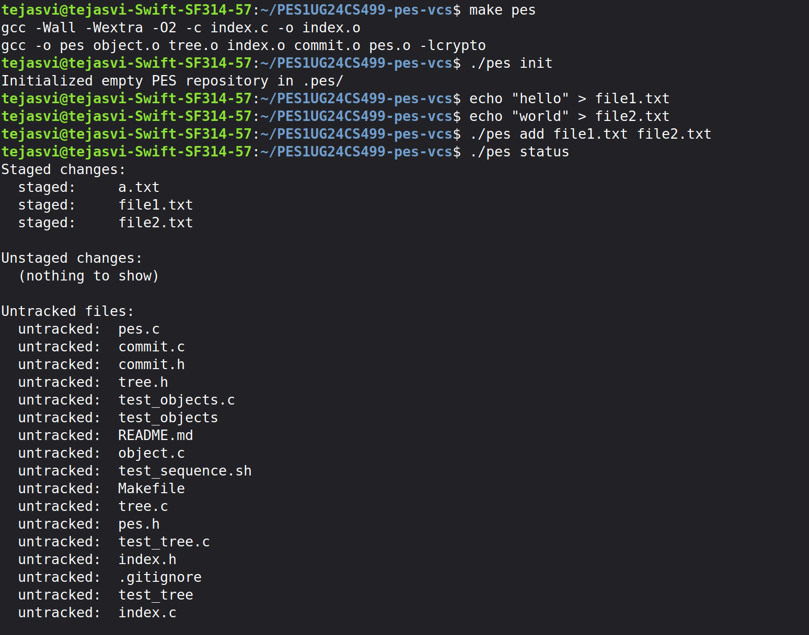

The sequence shows:
- `make pes` compiles all source files cleanly
- `./pes init` creates the `.pes/` directory structure
- `./pes add file1.txt file2.txt` stages both files (a pre-existing `a.txt` was already staged)
- `./pes status` correctly reports three staged files, no unstaged changes, and lists all untracked source files

---

### Screenshot 3B — Index File Contents

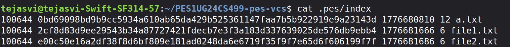

The `.pes/index` file is human-readable plain text. Each line contains the file mode in octal (`100644` = regular non-executable file), the 64-character SHA-256 hex hash of the staged blob, the modification timestamp in Unix seconds, the file size in bytes, and the file path. The three staged files (`a.txt`, `file1.txt`, `file2.txt`) are visible, sorted alphabetically by path.

---

## Phase 4 — Commits and History

### What Was Implemented

`commit_create` in `commit.c` is the function that ties all previous phases together into a complete commit operation.

**`commit_create` steps:**
1. Call `tree_from_index()` to snapshot the current staging area as a tree object hierarchy
2. Call `head_read()` to get the current HEAD commit hash as the parent; if HEAD doesn't resolve (first commit in an empty repo), `has_parent` is set to `0`
3. Fill the `Commit` struct: tree hash, optional parent hash, author string from `pes_author()`, Unix timestamp from `time(NULL)`, and the commit message
4. Call `commit_serialize()` to convert the struct to the text format: `tree <hex>\nparent <hex>\nauthor ...\ncommitter ...\n\n<message>`
5. Call `object_write(OBJ_COMMIT, ...)` to store the serialized commit in the object store
6. Call `head_update()` to atomically move the current branch pointer (`.pes/refs/heads/main`) to the new commit hash

**Key concepts demonstrated:** Linked list of commits via parent pointers, symbolic references (HEAD → refs/heads/main → commit hash), atomic pointer updates.

---

### Screenshot 4A — pes log Showing Three Commits

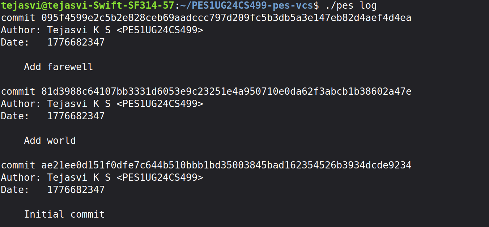

`./pes log` walks the commit chain from HEAD to the root by following parent pointers. The output shows three commits in reverse chronological order: "Add farewell", "Add world", and "Initial commit". Each entry shows the full 64-character SHA-256 hash, the author (`Tejasvi K S <PES1UG24CS499>`), a Unix timestamp, and the commit message.

---

### Screenshot 4B — Object Store Growth After Three Commits

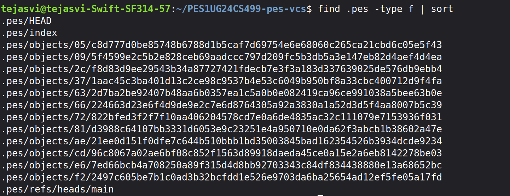

After three commits, the object store contains 14 files total. These consist of: 3 commit objects (one per commit), multiple tree objects (one per directory snapshot), multiple blob objects (one per unique file version), plus `.pes/HEAD`, `.pes/index`, and `.pes/refs/heads/main`. Unchanged file content across commits shares blob objects, demonstrating the deduplication benefit of content-addressable storage.

---

### Screenshot 4C — Reference Chain

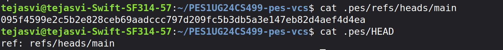

`.pes/refs/heads/main` contains the full 64-character hex hash of the most recent commit (`095f4599e2c5...`), which matches the top entry in `pes log`. `.pes/HEAD` contains the symbolic reference `ref: refs/heads/main`, meaning HEAD is not a commit hash directly — it points to the branch, which in turn points to the commit. This two-level indirection is what makes branch switching possible by just rewriting one reference file.

---

## Final Integration Test

### Screenshot — Full Integration Test (Part 1)

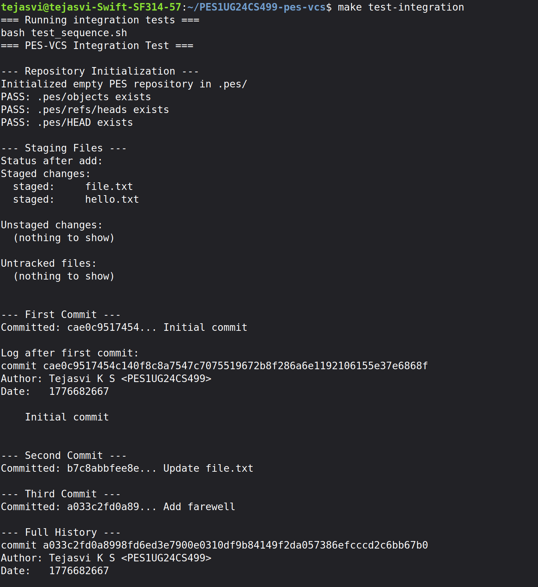

The integration test (`make test-integration` / `./test_sequence.sh`) runs the complete end-to-end workflow in an isolated temporary directory: repository initialization, staging two files, creating three sequential commits, and verifying the full commit history. All structural checks pass — `.pes/objects`, `.pes/refs/heads`, and `.pes/HEAD` all exist and are correctly populated.

### Screenshot — Full Integration Test (Part 2)

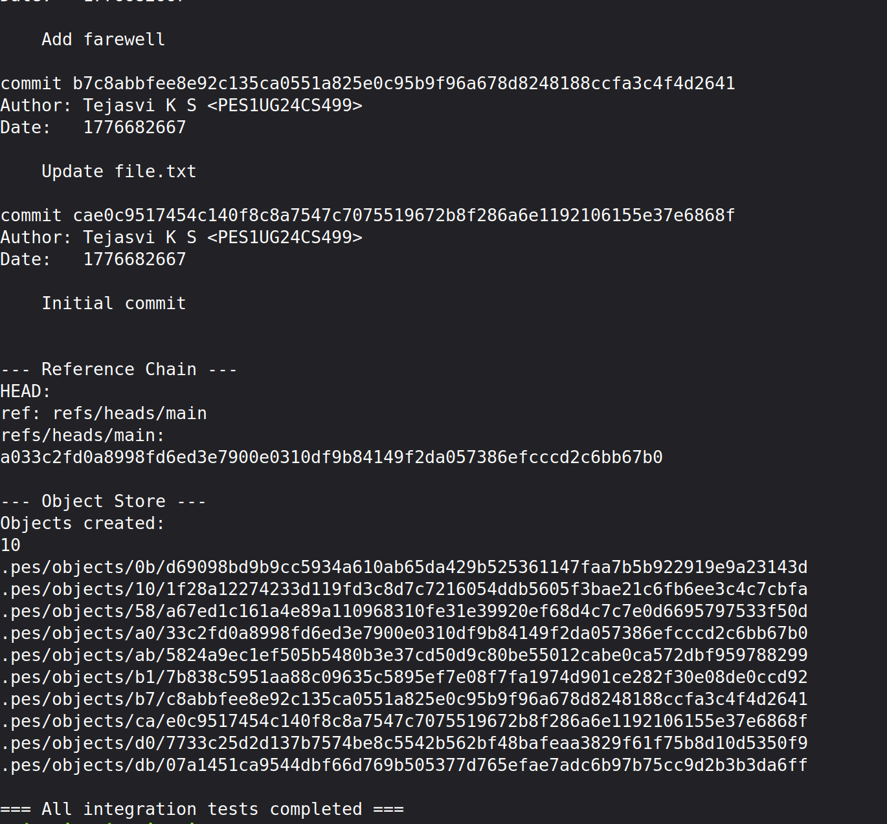

The second part of the integration test shows the reference chain verification (`HEAD` → `refs/heads/main` → commit hash), the complete sorted listing of all 10 objects created during the test run, and the final `=== All integration tests completed ===` message confirming every phase of the system works correctly end-to-end.

---

## Phase 5 — Branching and Checkout (Analysis)

### Q5.1 — How would you implement `pes checkout <branch>`?

To implement `pes checkout <branch>`, the following sequence of operations would be required:

**Files that need to change inside `.pes/`:**
- `.pes/HEAD` must be updated to `ref: refs/heads/<branch>` (or to the raw commit hash for detached HEAD)
- `.pes/index` must be rewritten to reflect the tree of the target commit
- No other files inside `.pes/` need to change — the object store is immutable and shared across all branches

**What must happen to the working directory:**
1. Read the current HEAD commit and walk its tree to get the current set of tracked files and their blob hashes
2. Read the target branch's commit and walk its tree to get the target set of files and their blob hashes
3. For each file in the target tree that differs from the current tree (or is new), read the blob from the object store and write it to the working directory
4. Delete any working-directory files that are tracked in the current branch's tree but absent from the target branch's tree
5. Rewrite `.pes/index` to match the target tree exactly

**What makes this operation complex:**
The core difficulty is that checkout must handle three simultaneous concerns atomically. First, it must detect and refuse to overwrite uncommitted local changes (dirty working directory) before it has modified anything. Second, the update of working directory files, the index, and HEAD should appear atomic — a crash mid-checkout should not leave the repository in a state where HEAD points to a new branch but the working directory and index still reflect the old one. Third, subdirectory handling adds recursive complexity: a file that exists in one branch under `src/main.c` but not in another requires potentially creating or deleting the `src/` directory itself, not just the file.

---

### Q5.2 — Detecting "Dirty Working Directory" Conflicts

Before proceeding with a checkout, the system must identify files where both of the following are true simultaneously:

1. **The file differs between the source and target branches** — compare the blob hash stored for the file path in the current HEAD's tree against the blob hash for the same path in the target branch's tree. If they differ (or the file only exists in one branch), the checkout would need to modify this file.

2. **The user has local uncommitted changes to that file** — compare the `mtime` and `size` stored in the index entry against the actual `mtime` and `size` reported by `lstat()` on the working directory file. If either differs, the file has been modified since it was staged. For higher certainty, the file could be re-hashed and compared against the index blob hash, but the metadata fast-path is sufficient for detecting modifications.

If both conditions are true for the same file path — the checkout would change it, AND the user has unsaved local edits to it — then checkout must refuse with an error like `error: Your local changes to 'src/main.c' would be overwritten by checkout`. If only condition 1 is true (branches differ but no local edits), the file can be safely updated. If only condition 2 is true (local edits but branches agree on this file), the checkout can proceed without touching that file.

---

### Q5.3 — Detached HEAD State and Recovery

**What "Detached HEAD" means structurally:** In normal operation, `.pes/HEAD` contains a symbolic reference like `ref: refs/heads/main`. In detached HEAD state, it contains a raw commit hash directly, e.g. `ae21ee0d151f0dfe7c644b...`. This happens when you checkout a specific commit hash or tag rather than a branch name.

**What happens when you make commits in this state:** Commits are created and stored in the object store correctly. Each new commit correctly references the previous one as its parent. However, because no branch file is being updated — `head_update()` would be updating `.pes/HEAD` directly rather than a ref file under `.pes/refs/heads/` — the new commits exist in the object store but are not reachable from any named branch. The moment you checkout a different branch, the commit chain becomes unreachable.

**How a user could recover those commits:** While still in detached HEAD (or if the commit hashes were recorded), run `./pes log` to identify the tip commit hash of the work done in detached HEAD. Then manually create a new branch pointing to it:
```bash
echo "<commit-hash>" > .pes/refs/heads/recovery-branch
```
Then update HEAD to point to the new branch:
```bash
echo "ref: refs/heads/recovery-branch" > .pes/HEAD
```
This makes all the commits reachable again through the named branch. In a more complete implementation, a `reflog` — a log of every position HEAD has ever pointed to — would make this recovery automatic without needing to know the commit hash in advance.

---

## Phase 6 — Garbage Collection (Analysis)

### Q6.1 — Algorithm to Find and Delete Unreachable Objects

**The algorithm (mark-and-sweep):**

**Mark phase** — collect all reachable object hashes into a set:
1. Start with every file in `.pes/refs/heads/` — these are the branch tip commit hashes. Add each to a `reachable` hash set (an in-memory set of `ObjectID` values).
2. For each commit hash in the set, read the commit object and add its tree hash to the set. If the commit has a parent, add the parent hash to a queue.
3. Continue following parent pointers until reaching a root commit (no parent). This traverses the entire commit history of every branch.
4. For each tree hash encountered, read the tree object and add every entry hash (blob or subtree) to the set. Recurse into subtrees.
5. After full traversal, the `reachable` set contains every object that any branch can reach, transitively.

**Sweep phase** — delete what is not reachable:
1. Walk every file under `.pes/objects/` using `opendir`/`readdir` recursively.
2. Reconstruct the `ObjectID` from the two-character shard directory name plus the filename.
3. If the hash is NOT in the `reachable` set, delete the file.

**Data structure:** An open-addressing or chained hash set keyed on the 32-byte `ObjectID` gives O(1) average lookup. A visited set is also needed during the mark phase to avoid re-processing objects already seen (a commit graph can have shared subtrees).

**Estimate for 100,000 commits and 50 branches:** Assuming each commit references a root tree with an average of 20 blobs and 5 subtrees, each object set has roughly 25 objects per commit. Total objects to visit during the mark phase: 100,000 commits × 26 objects each ≈ 2,600,000 object reads. In practice many objects are shared (unchanged files), so the actual unique objects in the store would be far fewer — perhaps 200,000–500,000 — but the mark traversal must visit each reachable one.

---

### Q6.2 — GC Race Condition and How Git Avoids It

**The race condition:**

Consider two concurrent operations — Thread A running a `commit_create` and Thread B running garbage collection:

1. Thread A calls `object_write(OBJ_BLOB, ...)` for a new file. The blob is now written to `.pes/objects/` but is not yet referenced by any tree or commit object — it exists in the store as an "orphan."
2. Thread B begins its mark phase at this exact moment. It walks all branches and all reachable commit chains. The new blob has no path from any branch to it, so it is not added to the `reachable` set.
3. Thread B's sweep phase deletes the blob — it appears to be unreachable garbage.
4. Thread A now calls `object_write(OBJ_TREE, ...)` and `object_write(OBJ_COMMIT, ...)`, which reference the blob hash in their data. The commit is written successfully and HEAD is updated.
5. The repository is now corrupt: the commit references a blob hash that no longer exists on disk. Any future `object_read` of that blob will fail.

**How Git avoids this:**

Git uses two complementary strategies:

First, a **grace period**: the real `git gc` never deletes any object created within the last two weeks (configurable via `gc.pruneExpire`). Since the window for the above race is milliseconds, a two-week grace period makes the race effectively impossible in practice. A newly written blob that hasn't been referenced yet is safe because it's too recent to be collected.

Second, **lock files**: before any write operation (commit, rebase, fetch), Git acquires an exclusive lock on the ref it will update (e.g. `.git/refs/heads/main.lock`). The GC process checks for the existence of any lock files before running and either waits or refuses to collect if any locks are held — indicating an active write operation is in progress.

---

## Summary

All four implementation phases are complete and all tests pass — Phase 1 object store tests, Phase 2 tree tests, and the full end-to-end integration test. The system correctly implements the core data model of Git: content-addressable blobs, deterministic tree snapshots, linked commit history via parent pointers, and symbolic branch references — all built on atomic filesystem operations.
